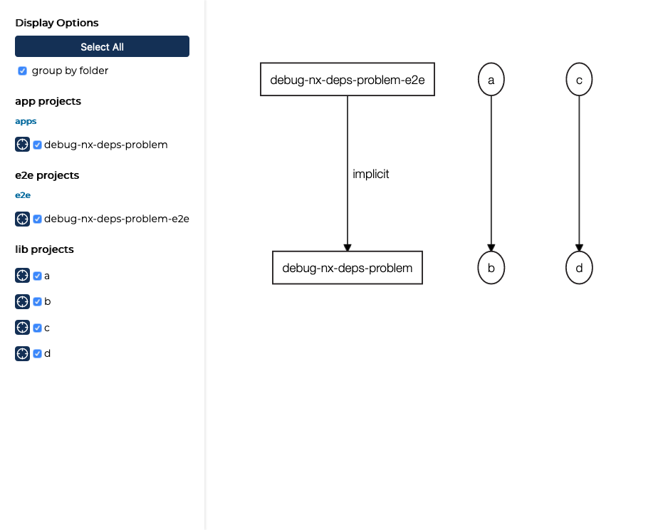
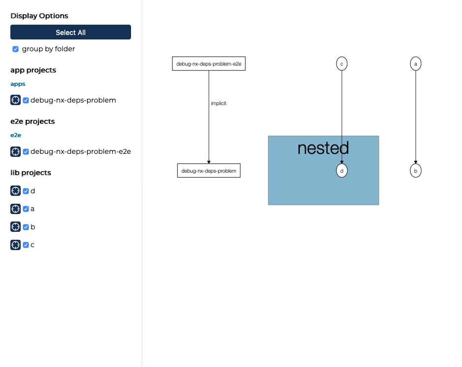
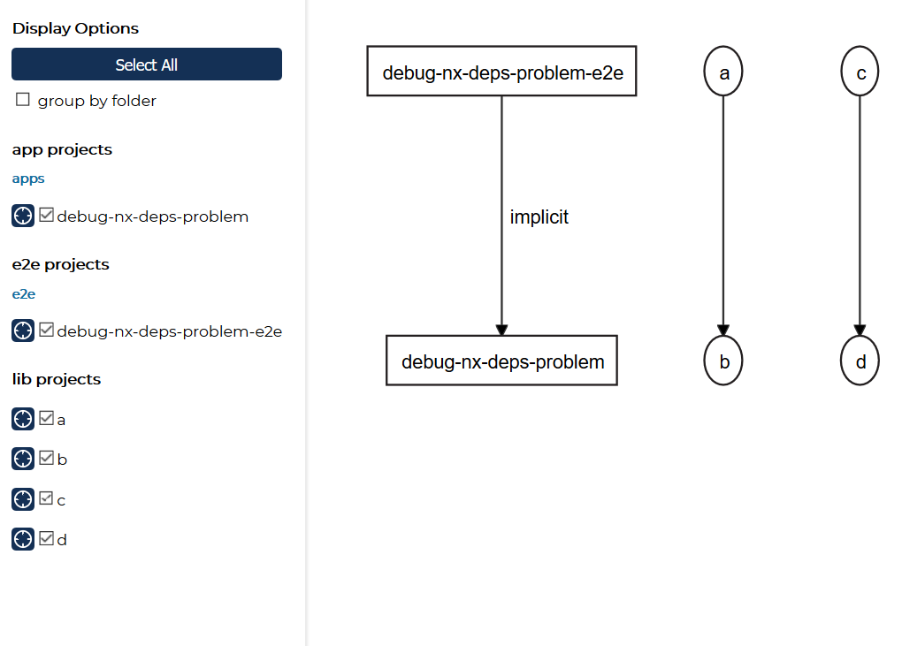
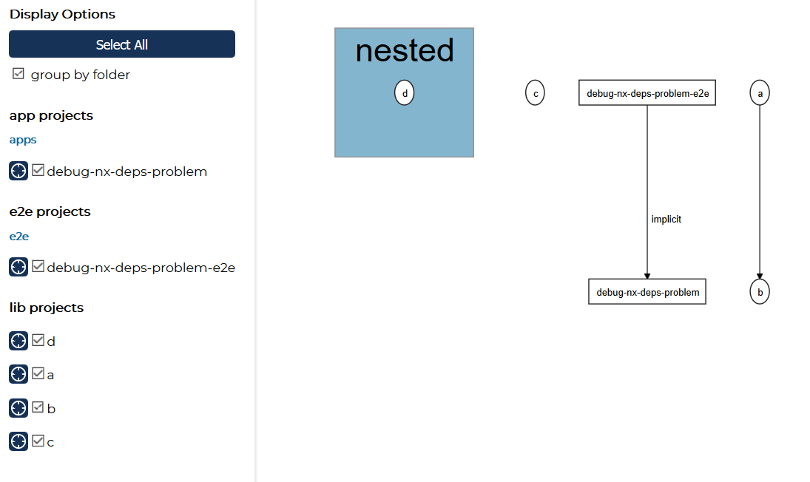

# Debug Dependency Graph
We encounter some issues with lib-to-lib building. Nx Workspace introduced a great feature in the PR [feat(angular): library builder to handle buildable libraries with deps](https://github.com/nrwl/nx/pull/2307) to update the tsconfig and replace the source paths with the dist paths of the generated libraries. That's required otherwise you will end with the famous `rootDir` error. 

```
error TS6059: File 'not-foo/bar/abc.ts' is not under 'rootDir' 'foo/src'. 'rootDir' is expected to contain all source files.
``` 

This error is either caused by a relative path going outside of your library or you import something from another local library that is mapped by Typescript to the source files instead of an already build package. Nx fix the latter by swapping the path in tsconfig with the actual dist/ folder path 👌 The builder works great for us and I applaud to everyone who contributed to this so we don't have to manually manage our tsconfig variants.
BUT: There seems to be a problem on some windows machines. The dependencies are not recognized properly and you can spot that already in the dep-graph before any building. Here is minimal repo to reproduce and document it.


## Baseline
That's how I created the project, which means is a standard project.

```
create-nx-workspace debug-nx-deps-problem --preset angular --appName debug-nx-deps-problem --style=css --cli=nx
cd debug-nx-deps-problem

yarn nx g @nrwl/angular:lib a --publishable --style=css
yarn nx g @nrwl/angular:lib b --publishable --style=css
yarn nx g @nrwl/angular:lib c --publishable --style=css
yarn nx g @nrwl/angular:lib d --publishable --style=css


# Prepare: Add actual dependencies to a (dep on b) and c (dep on d).

```

Nx has no expressive verbose mode, so I prepared a debug script that will monkey patch Nx's core file `buildable-libs-utils.js` which is involved in providing utilities for the dependency graph. You will get the following output per package during a build in addition to the other logs.

```
> nx run a:build
---- checkDependentProjectsHaveBeenBuilt: [
  '/debug-nx-deps-problem/dist/libs/b/package.json'
]
---- updatePaths. dependencies: [
  {
    name: '@debug-nx-deps-problem/b',
    outputs: [ 'dist/libs/b' ],
    node: { name: 'b', type: 'lib', data: [Object] }
  }
]
```

## Context: OSX (✅)

```
Node: v12.10.0
OSX 10.15.4
```

Here the report for OSX. Everything works as expected.

### Flat (✅)

```
git co scenario-flat
yarn nx dep-graph

```



Build works:
```
yarn debug-nx-build

# runs this:
# yarn nx run-many --target=build --projects=a,c --with-deps --skip-nx-cache
```

<details>
	<summary>📙 Bash Log (with debug task)</summary>

```
$ nx run-many --target=build --projects=a,c --with-deps --skip-nx-cache

>  NX  Running target build for projects:

  - b
  - a
  - d
  - c

———————————————————————————————————————————————

> nx run d:build
---- updatePaths. dependencies: []
Building Angular Package
******************************************************************************
It is not recommended to publish Ivy libraries to NPM repositories.
Read more here: https://v9.angular.io/guide/ivy#maintaining-library-compatibility
******************************************************************************

------------------------------------------------------------------------------
Building entry point '@debug-nx-deps-problem/d'
------------------------------------------------------------------------------
Compiling TypeScript sources through ngc
Bundling to FESM2015
Bundling to FESM5
Bundling to UMD
Minifying UMD bundle
Writing package metadata
Built @debug-nx-deps-problem/d

------------------------------------------------------------------------------
Built Angular Package
 - from: debug-nx-deps-problem/libs/d
 - to:   debug-nx-deps-problem/dist/libs/d
------------------------------------------------------------------------------

> nx run b:build
---- updatePaths. dependencies: []
Building Angular Package
******************************************************************************
It is not recommended to publish Ivy libraries to NPM repositories.
Read more here: https://v9.angular.io/guide/ivy#maintaining-library-compatibility
******************************************************************************

------------------------------------------------------------------------------
Building entry point '@debug-nx-deps-problem/b'
------------------------------------------------------------------------------
Compiling TypeScript sources through ngc
Bundling to FESM2015
Bundling to FESM5
Bundling to UMD
Minifying UMD bundle
Writing package metadata
Built @debug-nx-deps-problem/b

------------------------------------------------------------------------------
Built Angular Package
 - from: debug-nx-deps-problem/libs/b
 - to:   debug-nx-deps-problem/dist/libs/b
------------------------------------------------------------------------------

> nx run c:build
---- checkDependentProjectsHaveBeenBuilt: [
  'debug-nx-deps-problem/dist/libs/d/package.json'
]
---- updatePaths. dependencies: [
  {
    name: '@debug-nx-deps-problem/d',
    outputs: [ 'dist/libs/d' ],
    node: { name: 'd', type: 'lib', data: [Object] }
  }
]
updatePaths of: @debug-nx-deps-problem/d
current value: libs/d/src/index.ts
overriden value: dist/libs/d
Building Angular Package
******************************************************************************
It is not recommended to publish Ivy libraries to NPM repositories.
Read more here: https://v9.angular.io/guide/ivy#maintaining-library-compatibility
******************************************************************************

------------------------------------------------------------------------------
Building entry point '@debug-nx-deps-problem/c'
------------------------------------------------------------------------------
Compiling TypeScript sources through ngc
Bundling to FESM2015
Bundling to FESM5
Bundling to UMD
WARNING: No name was provided for external module '@debug-nx-deps-problem/d' in output.globals – guessing 'd'
Minifying UMD bundle
Writing package metadata
Built @debug-nx-deps-problem/c

------------------------------------------------------------------------------
Built Angular Package
 - from: debug-nx-deps-problem/libs/c
 - to:   debug-nx-deps-problem/dist/libs/c
------------------------------------------------------------------------------

> nx run a:build
---- checkDependentProjectsHaveBeenBuilt: [
  'debug-nx-deps-problem/dist/libs/b/package.json'
]
---- updatePaths. dependencies: [
  {
    name: '@debug-nx-deps-problem/b',
    outputs: [ 'dist/libs/b' ],
    node: { name: 'b', type: 'lib', data: [Object] }
  }
]
updatePaths of: @debug-nx-deps-problem/b
current value: libs/b/src/index.ts
overriden value: dist/libs/b
Building Angular Package
******************************************************************************
It is not recommended to publish Ivy libraries to NPM repositories.
Read more here: https://v9.angular.io/guide/ivy#maintaining-library-compatibility
******************************************************************************

------------------------------------------------------------------------------
Building entry point '@debug-nx-deps-problem/a'
------------------------------------------------------------------------------
Compiling TypeScript sources through ngc
Bundling to FESM2015
Bundling to FESM5
Bundling to UMD
WARNING: No name was provided for external module '@debug-nx-deps-problem/b' in output.globals – guessing 'b'
Minifying UMD bundle
Writing package metadata
Built @debug-nx-deps-problem/a

------------------------------------------------------------------------------
Built Angular Package
 - from: debug-nx-deps-problem/libs/a
 - to:   debug-nx-deps-problem/dist/libs/a
------------------------------------------------------------------------------

———————————————————————————————————————————————

>  NX   SUCCESS  Running target "build" succeeded


✨  Done in 11.90s.
```

</details>


### Nested (✅)
Moved `d` into subfolder. 
Graph looks good. The option "group by folder" is supported in the graph viewer. So it's kind of expected to introduce folders for grouping ?

```
git co scenario-nested
yarn nx dep-graph
```



Build works:
```
yarn debug-nx-build

# runs this:
# yarn nx run-many --target=build --projects=a,c --with-deps --skip-nx-cache
```

<details>
	<summary>📙 Bash Log (with debug task)</summary>

```
$ yarn debug-nx-build
$ sh debug.sh
Debugging Nx Workspace
Debug Patch for console output
patching file node_modules/@nrwl/workspace/src/utils/buildable-libs-utils.js
Clean Dist Folder

nx run-many --target=build --projects=a,c --with-deps --skip-nx-cache

>  NX  Running target build for projects:

  - b
  - a
  - d
  - c

———————————————————————————————————————————————

> nx run d:build
---- updatePaths. dependencies: []
Building Angular Package
******************************************************************************
It is not recommended to publish Ivy libraries to NPM repositories.
Read more here: https://v9.angular.io/guide/ivy#maintaining-library-compatibility
******************************************************************************

------------------------------------------------------------------------------
Building entry point '@debug-nx-deps-problem/d'
------------------------------------------------------------------------------
Compiling TypeScript sources through ngc
Bundling to FESM2015
Bundling to FESM5
Bundling to UMD
Minifying UMD bundle
Writing package metadata
Built @debug-nx-deps-problem/d

------------------------------------------------------------------------------
Built Angular Package
 - from: debug-nx-deps-problem/libs/nested/d
 - to:   debug-nx-deps-problem/dist/libs/nested/d
------------------------------------------------------------------------------

> nx run b:build
---- updatePaths. dependencies: []
Building Angular Package
******************************************************************************
It is not recommended to publish Ivy libraries to NPM repositories.
Read more here: https://v9.angular.io/guide/ivy#maintaining-library-compatibility
******************************************************************************

------------------------------------------------------------------------------
Building entry point '@debug-nx-deps-problem/b'
------------------------------------------------------------------------------
Compiling TypeScript sources through ngc
Bundling to FESM2015
Bundling to FESM5
Bundling to UMD
Minifying UMD bundle
Writing package metadata
Built @debug-nx-deps-problem/b

------------------------------------------------------------------------------
Built Angular Package
 - from: debug-nx-deps-problem/libs/b
 - to:   debug-nx-deps-problem/dist/libs/b
------------------------------------------------------------------------------

> nx run c:build
---- checkDependentProjectsHaveBeenBuilt: [
  'debug-nx-deps-problem/dist/libs/nested/d/package.json'
]
---- updatePaths. dependencies: [
  {
    name: '@debug-nx-deps-problem/d',
    outputs: [ 'dist/libs/nested/d' ],
    node: { name: 'd', type: 'lib', data: [Object] }
  }
]
updatePaths of: @debug-nx-deps-problem/d
current value: libs/nested/d/src/index.ts
overriden value: dist/libs/nested/d
Building Angular Package
******************************************************************************
It is not recommended to publish Ivy libraries to NPM repositories.
Read more here: https://v9.angular.io/guide/ivy#maintaining-library-compatibility
******************************************************************************

------------------------------------------------------------------------------
Building entry point '@debug-nx-deps-problem/c'
------------------------------------------------------------------------------
Compiling TypeScript sources through ngc
Bundling to FESM2015
Bundling to FESM5
Bundling to UMD
WARNING: No name was provided for external module '@debug-nx-deps-problem/d' in output.globals – guessing 'd'
Minifying UMD bundle
Writing package metadata
Built @debug-nx-deps-problem/c

------------------------------------------------------------------------------
Built Angular Package
 - from: debug-nx-deps-problem/libs/c
 - to:   debug-nx-deps-problem/dist/libs/c
------------------------------------------------------------------------------

> nx run a:build
---- checkDependentProjectsHaveBeenBuilt: [
  'debug-nx-deps-problem/dist/libs/b/package.json'
]
---- updatePaths. dependencies: [
  {
    name: '@debug-nx-deps-problem/b',
    outputs: [ 'dist/libs/b' ],
    node: { name: 'b', type: 'lib', data: [Object] }
  }
]
updatePaths of: @debug-nx-deps-problem/b
current value: libs/b/src/index.ts
overriden value: dist/libs/b
Building Angular Package
******************************************************************************
It is not recommended to publish Ivy libraries to NPM repositories.
Read more here: https://v9.angular.io/guide/ivy#maintaining-library-compatibility
******************************************************************************

------------------------------------------------------------------------------
Building entry point '@debug-nx-deps-problem/a'
------------------------------------------------------------------------------
Compiling TypeScript sources through ngc
Bundling to FESM2015
Bundling to FESM5
Bundling to UMD
WARNING: No name was provided for external module '@debug-nx-deps-problem/b' in output.globals – guessing 'b'
Minifying UMD bundle
Writing package metadata
Built @debug-nx-deps-problem/a

------------------------------------------------------------------------------
Built Angular Package
 - from: debug-nx-deps-problem/libs/a
 - to:   debug-nx-deps-problem/dist/libs/a
------------------------------------------------------------------------------

———————————————————————————————————————————————

>  NX   SUCCESS  Running target "build" succeeded


✨  Done in 12.04s.

```
		
</details>


## Context: Windows (🛑)

```
Node: 12.14.1
Win 10 Enterprise Version 1607
```


### Flat (✅)
Graph is good:

```
git co scenario-nested
yarn nx dep-graph
```



Build works:
```

yarn debug-nx-build

# runs this:
# yarn nx run-many --target=build --projects=a,c --with-deps --skip-nx-cache

```

<details>
	<summary>📙 Bash Log (Debug)</summary>

```
$ nx run-many --target=build --projects=a,c --with-deps --skip-nx-cache

>  NX  Running target build for projects:

  - b
  - a
  - d
  - c

———————————————————————————————————————————————

> nx run d:build
Building Angular Package
******************************************************************************
It is not recommended to publish Ivy libraries to NPM repositories.
Read more here: https://v9.angular.io/guide/ivy#maintaining-library-compatibility
******************************************************************************

------------------------------------------------------------------------------
Building entry point '@debug-nx-deps-problem/d'
------------------------------------------------------------------------------
Compiling TypeScript sources through ngc
Bundling to FESM2015
Bundling to FESM5
Bundling to UMD
Minifying UMD bundle
Writing package metadata
Built @debug-nx-deps-problem/d

------------------------------------------------------------------------------
Built Angular Package
 - from: nx-debug-nested-dep-graph-scenario-flat\libs\d
 - to:   nx-debug-nested-dep-graph-scenario-flat\dist\libs\d
------------------------------------------------------------------------------

> nx run b:build
Building Angular Package
******************************************************************************
It is not recommended to publish Ivy libraries to NPM repositories.
Read more here: https://v9.angular.io/guide/ivy#maintaining-library-compatibility
******************************************************************************

------------------------------------------------------------------------------
Building entry point '@debug-nx-deps-problem/b'
------------------------------------------------------------------------------
Compiling TypeScript sources through ngc
Bundling to FESM2015
Bundling to FESM5
Bundling to UMD
Minifying UMD bundle
Writing package metadata
Built @debug-nx-deps-problem/b

------------------------------------------------------------------------------
Built Angular Package
 - from: nx-debug-nested-dep-graph-scenario-flat\libs\b
 - to:   nx-debug-nested-dep-graph-scenario-flat\dist\libs\b
------------------------------------------------------------------------------

> nx run c:build
Building Angular Package
******************************************************************************
It is not recommended to publish Ivy libraries to NPM repositories.
Read more here: https://v9.angular.io/guide/ivy#maintaining-library-compatibility
******************************************************************************

------------------------------------------------------------------------------
Building entry point '@debug-nx-deps-problem/c'
------------------------------------------------------------------------------
Compiling TypeScript sources through ngc
Bundling to FESM2015
Bundling to FESM5
Bundling to UMD
WARNING: No name was provided for external module '@debug-nx-deps-problem/d' in output.globals – guessing 'd'
Minifying UMD bundle
Writing package metadata
Built @debug-nx-deps-problem/c

------------------------------------------------------------------------------
Built Angular Package
 - from: nx-debug-nested-dep-graph-scenario-flat\libs\c
 - to:   nx-debug-nested-dep-graph-scenario-flat\dist\libs\c
------------------------------------------------------------------------------

> nx run a:build
Building Angular Package
******************************************************************************
It is not recommended to publish Ivy libraries to NPM repositories.
Read more here: https://v9.angular.io/guide/ivy#maintaining-library-compatibility
******************************************************************************

------------------------------------------------------------------------------
Building entry point '@debug-nx-deps-problem/a'
------------------------------------------------------------------------------
Compiling TypeScript sources through ngc
Bundling to FESM2015
Bundling to FESM5
Bundling to UMD
WARNING: No name was provided for external module '@debug-nx-deps-problem/b' in output.globals – guessing 'b'
Minifying UMD bundle
Writing package metadata
Built @debug-nx-deps-problem/a

------------------------------------------------------------------------------
Built Angular Package
 - from: nx-debug-nested-dep-graph-scenario-flat\libs\a
 - to:   nx-debug-nested-dep-graph-scenario-flat\dist\libs\a
------------------------------------------------------------------------------

———————————————————————————————————————————————

>  NX   SUCCESS  Running target "build" succeeded


Done in 95.17s.
```

</details>


### Nested (🛑)
Moved `d` into subfolder. Graph is wrong.

```
git co scenario-nested
yarn nx dep-graph
```



Build fails:
```

yarn debug-nx-build

# runs this:
# yarn nx run-many --target=build --projects=a,c --with-deps --skip-nx-cache

```

>  'rootDir' is expected to contain all source files.
because the nested dependency `d` is not recognized as the dependency of `c`. That's why c is not build and the tsconfig is not updated properly.

<details>
	<summary>📙 Bash Log (Debug)</summary>

```
$ yarn debug-nx-build
$ sh debug.sh
Debugging Nx Workspace
Debug Patch for console output
patching file node_modules/@nrwl/workspace/src/utils/buildable-libs-utils.js
Clean Dist Folder
$ nx run-many --target=build --projects=a,c --with-deps --skip-nx-cache

>  NX  Running target build for projects:

  - b
  - a
  - c

———————————————————————————————————————————————

> nx run c:build
---- updatePaths. dependencies: []
Building Angular Package
******************************************************************************
It is not recommended to publish Ivy libraries to NPM repositories.
Read more here: https://v9.angular.io/guide/ivy#maintaining-library-compatibility
******************************************************************************

------------------------------------------------------------------------------
Building entry point '@debug-nx-deps-problem/c'
------------------------------------------------------------------------------
Compiling TypeScript sources through ngc
ERROR: libs/nested/d/src/index.ts:1:15 - error TS6059: File 'nx-debug-nested-dep-graph-scenario-nested/libs/nested/d/src/lib/d.module.ts' is not under 'rootDir' 'nx-debug-nested-dep-graph-scenario-nested\libs\c\src'. 'rootDir' is expected to contain all source files.

1 export * from './lib/d.module';
                ~~~~~~~~~~~~~~~~
libs/c/src/index.ts:2:19 - error TS6059: File 'nx-debug-nested-dep-graph-scenario-nested/libs/nested/d/src/index.ts' is not under 'rootDir' 'nx-debug-nested-dep-graph-scenario-nested\libs\c\src'. 'rootDir' is expected to contain all source files.

2 import { D } from '@debug-nx-deps-problem/d';
                    ~~~~~~~~~~~~~~~~~~~~~~~~~~

libs/nested/d/src/index.ts:1:15 - error TS6059: File 'nx-debug-nested-dep-graph-scenario-nested/libs/nested/d/src/lib/d.module.ts' is not under 'rootDir' 'nx-debug-nested-dep-graph-scenario-nested\libs\c\src'. 'rootDir' is expected to contain all source files.

1 export * from './lib/d.module';
                ~~~~~~~~~~~~~~~~
libs/c/src/index.ts:2:19 - error TS6059: File 'nx-debug-nested-dep-graph-scenario-nested/libs/nested/d/src/index.ts' is not under 'rootDir' 'nx-debug-nested-dep-graph-scenario-nested\libs\c\src'. 'rootDir' is expected to contain all source files.

2 import { D } from '@debug-nx-deps-problem/d';
                    ~~~~~~~~~~~~~~~~~~~~~~~~~~


> nx run b:build
---- updatePaths. dependencies: []
Building Angular Package
******************************************************************************
It is not recommended to publish Ivy libraries to NPM repositories.
Read more here: https://v9.angular.io/guide/ivy#maintaining-library-compatibility
******************************************************************************

------------------------------------------------------------------------------
Building entry point '@debug-nx-deps-problem/b'
------------------------------------------------------------------------------
Compiling TypeScript sources through ngc
Bundling to FESM2015
Bundling to FESM5
Bundling to UMD
Minifying UMD bundle
Writing package metadata
Built @debug-nx-deps-problem/b

------------------------------------------------------------------------------
Built Angular Package
 - from: nx-debug-nested-dep-graph-scenario-nested\libs\b
 - to:   nx-debug-nested-dep-graph-scenario-nested\dist\libs\b
------------------------------------------------------------------------------

———————————————————————————————————————————————

>  NX   ERROR  Running target "build" failed

  Failed projects:

  - c
  - a

  You can isolate the above projects by passing: --only-failed

error Command failed with exit code 1.
info Visit https://yarnpkg.com/en/docs/cli/run for documentation about this command.
Revert Debug Patch
patching file node_modules/@nrwl/workspace/src/utils/buildable-libs-utils.js
Done in 27.16s.
```

</details>